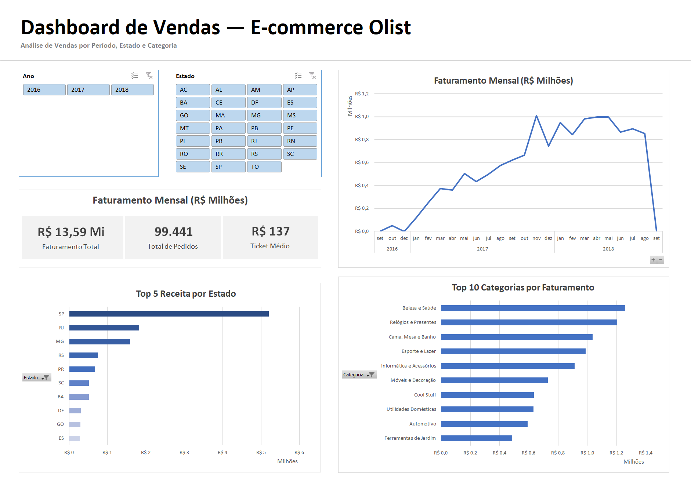

# 📊 Dashboard de Vendas — E-commerce Olist

## 🎯 Objetivo

Desenvolver um dashboard interativo no Excel para análise de desempenho de vendas, com foco em métricas de negócio e suporte à tomada de decisão.

---

## 📷 Visão do Dashboard

---

## 📄 Versão em PDF

Você também pode visualizar o dashboard em PDF:

[📥 Baixar Dashboard em PDF](dashboard-olist.pdf)

---

## 🚀 Como visualizar

* Baixe o arquivo `.xlsx`
* Abra no Excel
* Utilize os filtros do dashboard para explorar os dados

---

## 📊 Principais Métricas (KPIs)

* Faturamento Total
* Total de Pedidos
* Ticket Médio

---

## 📈 Análises Disponíveis

* Evolução do faturamento ao longo do tempo
* Receita por estado
* Top 10 categorias por faturamento
* Filtros interativos por ano e estado

---

## 🧰 Ferramentas Utilizadas

* Excel
* Power Query
* Tabelas Dinâmicas

---

## 🔄 Etapas do Projeto

### 🔹 Tratamento de Dados

* Integração das tabelas: orders, customers, order_items e products
* Ajustes de formatação numérica

### 🔹 Modelagem

* Definição da granularidade (pedido vs item)
* Prevenção de duplicidade de faturamento

### 🔹 Construção de Métricas

* Cálculo dos principais KPIs de negócio

### 🔹 Visualização

* Desenvolvimento de dashboard interativo

---

## 📊 Principais Insights

* São Paulo concentra a maior parte da receita, indicando forte dependência regional
* Crescimento consistente ao longo de 2017 sugere expansão do negócio
* Categorias de maior valor agregado lideram faturamento

---

## ⚠️ Desafios

* Duplicação de dados após merges
* Definição da granularidade correta
* Problemas de formatação numérica

---

## 📂 Dataset

https://www.kaggle.com/datasets/olistbr/brazilian-ecommerce

---

## 👩‍💻 Autora

Emily Doratiotto

